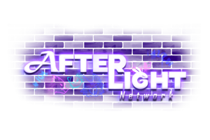

  

<!--  -->

# AFTERLIGHT  
Space-Station 14

AFTERLIGHT is an open source project aimed at creating unique mechanics, inspiring imaginative atmospheres, and adult-oriented roleplay in the game Space Station 14, a game about survival on a space station where there are constant confrontations between the crew and antagonists created to prevent the crew from achieving their goals.

## Space-Station 14 Documentation/Wiki

Space-Station 14 has [docs site](https://docs.spacestation14.io/) documentation on SS14s content, engine, game design and more. We also have lots of resources for new contributors to the project.

## Project Activity
<!--  -->

---

## License

> [!CAUTION]
> The repository code is licensed both multiple licenses: MIT - this applies to Space Wizards Federation code, modified MIT - this applies to code from Starlight-14, and a custom source license inspired by MariaDB's BSL, but not endorsed by MariaDB, and does not conform to the BSL specification known as the AFTERLIGHT SL - this applies to Afterlight-14's Code.

> [!IMPORTANT] 
> Afterlight-14 code and contributions are covered by [The Afterlight-14 CLA](https://gist.github.com/afterlight-ss14/e60089f7e2e66a1b190b8413fcad9343). Approved licenses for this project are listed below. The default license for original content is CC-BY-SA 4.0 (for sprites/art) and the Afterlight License for code/yaml.
### Click each banner for further information

---

  
>Some files are licensed under [The Afterlight Source license](https://github.com/Afterlight-RnD/Afterlight-14) , these files are Afterlight-14 code.

  
>Some files are licensed under [The Starlight license](https://github.com/ss14Starlight/space-station-14 ), these files are Starlight-14 code.

>Some files are licensed under [MIT license](https://opensource.org/license/MIT), these files are Space Wizards Federation code.

>All other non-code AFTERLIGHT Assets, including icons and sound files, are licensed under the [Creative Commons 4.0 BY-SA](https://creativecommons.org/licenses/by-sa/4.0/) license unless otherwise noted in the folder or file.

